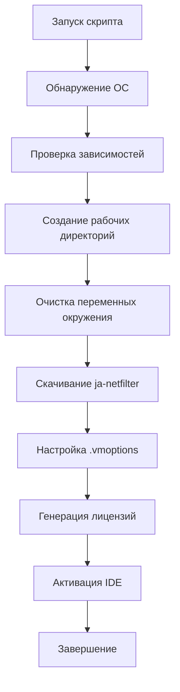
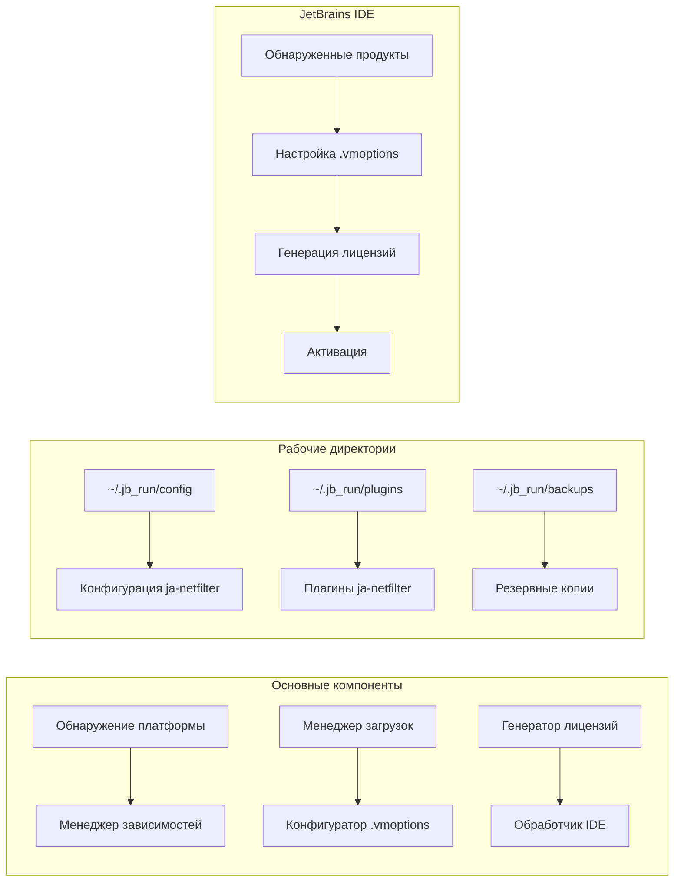
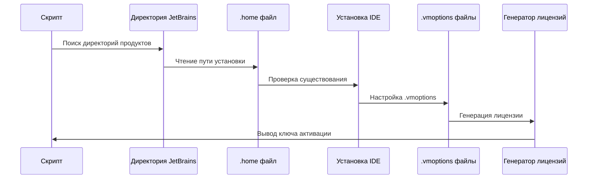
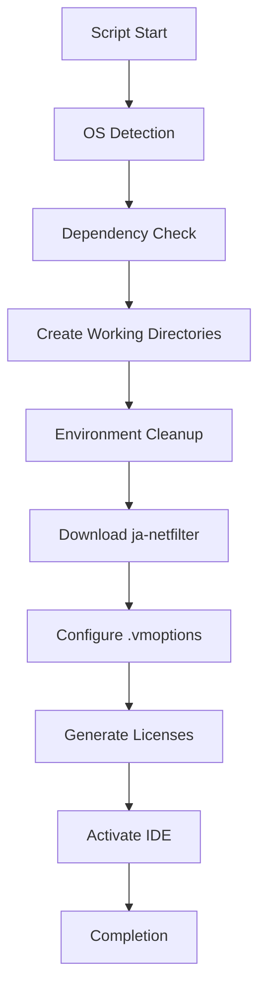
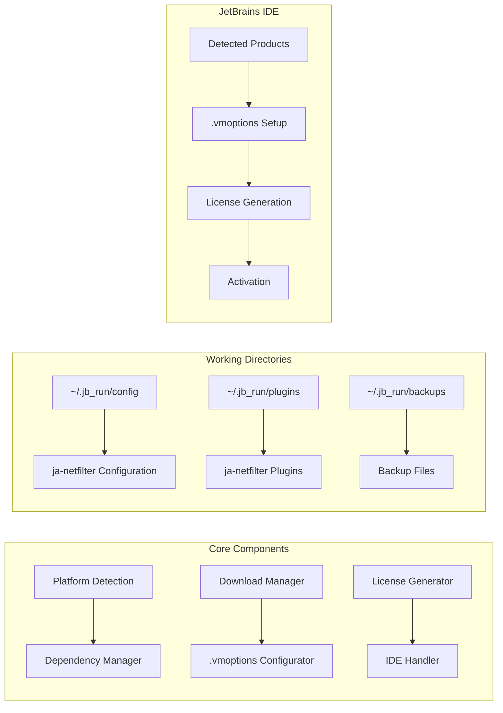
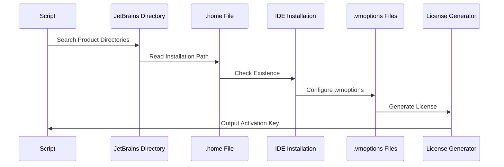

<div align="center">

# 🚀 ToolBox Activator


</div>

---

# ToolBox Activator (Русский)

### 🎯 Универсальный активатор для всех JetBrains IDE

**Автоматическая активация всех JetBrains IDE с помощью ja-netfilter**

[📖 Инструкция](#-установка-и-использование) • [🔧 Возможности](#-возможности) • [💻 Поддерживаемые IDE](#-поддерживаемые-ide) • [🛠️ Как это работает](#-как-это-работает)

---

```ascii
JJJJJJ   EEEEEEE   TTTTTTTT  BBBBBBB    RRRRRR    AAAAAA    IIIIIIII  NNNN   NN   SSSSSS
   JJ    EE           TT     BB    BB   RR   RR   AA  AA       II     NNNNN  NN  SS
   JJ    EE           TT     BB    BB   RR   RR   AA  AA       II     NN NNN NN   SS
   JJ    EEEEE        TT     BBBBBBB    RRRRRR    AAAAAA       II     NN  NNNNN    SSSSS
   JJ    EE           TT     BB    BB   RR   RR   AA  AA       II     NN   NNNN         SS
JJ JJ    EE           TT     BB    BB   RR   RR   AA  AA       II     NN    NNN          SS
 JJJJ    EEEEEEE      TT     BBBBBBB    RR   RR   AA  AA    IIIIIIII  NN    NNN    SSSSSS
```

## 📝 Описание

ToolBox Activator — это мощный и удобный инструмент для автоматической активации всех установленных JetBrains IDE. Скрипт работает на Windows, macOS и Linux, автоматически обнаруживает установленные продукты, скачивает необходимые компоненты ja-netfilter и генерирует лицензионные ключи.

---

## ✨ Возможности

- 🚀 **Быстрая активация** - активирует все установленные JetBrains IDE одной командой
- 🔄 **Автоматическое обнаружение** - находит все установленные продукты автоматически
- 🌐 **Мультиплатформенность** - поддержка Windows, macOS и Linux
- 📦 **Автоматическая установка зависимостей** - устанавливает curl и jq при необходимости
- 🧹 **Очистка переменных окружения** - удаляет следы предыдущих активаторов
- 💾 **Резервное копирование** - создает бэкапы перед изменением конфигурации
- 🔧 **Гибкая настройка** - возможность указать имя лицензии и срок действия
- 🛡️ **Безопасность** - проверка SHA-1 хэшей загруженных файлов
- 🎯 **Удобный интерфейс** - цветной вывод и прогресс-бары

---

## 💻 Поддерживаемые IDE

| IDE                  | Поддержка            | Поддержка |
| -------------------- | -------------------- | --------- |
| 🎨 **IntelliJ IDEA** | Ultimate & Community | ✅ Полная |
| ⚙️ **CLion**         | C/C++ IDE            | ✅ Полная |
| 🐘 **PhpStorm**      | PHP IDE              | ✅ Полная |
| 🎯 **GoLand**        | Go IDE               | ✅ Полная |
| 🐍 **PyCharm**       | Python IDE           | ✅ Полная |
| 🌐 **WebStorm**      | Web Frontend IDE     | ✅ Полная |
| 🎮 **Rider**         | .NET IDE             | ✅ Полная |
| 🗄️ **DataGrip**      | SQL IDE              | ✅ Полная |
| 💎 **RubyMine**      | Ruby IDE             | ✅ Полная |
| 🍎 **AppCode**       | iOS/macOS IDE        | ✅ Полная |
| 🔮 **DataSpell**     | Data Science IDE     | ✅ Полная |
| 🔍 **dotMemory**     | Memory Profiler      | ✅ Полная |
| 🦀 **RustRover**     | Rust IDE             | ✅ Полная |

---

## 🛠️ Установка и Использование

### 📋 Предварительные требования

- **Windows**: PowerShell 5.1+
- **macOS**: Bash/Zsh
- **Linux**: Bash
- **Интернет-соединение** для скачивания файлов

### 🚀 Быстрый старт

#### Windows (PowerShell)

```powershell
# Скачайте и запустите скрипт
Invoke-WebRequest -Uri "https://raw.githubusercontent.com/neKamita/toolbox-activator/main/activate.ps1" -OutFile "activate.ps1"
Set-ExecutionPolicy -ExecutionPolicy RemoteSigned -Scope Process
.\activate.ps1
```

#### macOS/Linux (Bash)

```bash
# Скачайте и запустите скрипт
curl -o activate.sh https://raw.githubusercontent.com/neKamita/toolbox-activator/main/activate.sh
chmod +x activate.sh
./activate.sh
```

### 📝 Пошаговая инструкция

1. **Скачайте скрипт** соответствующий вашей ОС
2. **Дайте права на исполнение** (для Linux/macOS):
   ```bash
   chmod +x activate.sh
   ```
3. **Запустите скрипт**:
   ```bash
   ./activate.sh  # Linux/macOS
   # или
   .\activate.ps1  # Windows
   ```
4. **Следуйте инструкциям** в консоли:
   - Введите имя лицензии (по умолчанию: `ckey.run`)
   - Укажите срок действия лицензии (по умолчанию: `2099-12-31`)
5. **Дождитесь завершения** активации всех продуктов
6. **Скопируйте лицензионные ключи** из вывода скрипта

---

## 🔧 Как это работает

### Процесс активации



### Архитектура скрипта



### Поток обработки IDE



---

## 🖥️ Поддерживаемые платформы

| Платформа      | Версия        | Поддержка    | Особенности           |
| -------------- | ------------- | ------------ | --------------------- |
| 🪟 **Windows** | 10/11         | ✅ Полная    | PowerShell 5.1+       |
| 🪟 **Windows** | 8.1           | ✅ Частичная | PowerShell 5.0        |
| 🍎 **macOS**   | Big Sur+      | ✅ Полная    | Apple Silicon/Intel   |
| 🍎 **macOS**   | Catalina      | ✅ Полная    | Intel процессоры      |
| 🐧 **Linux**   | Ubuntu 20.04+ | ✅ Полная    | apt/dnf/yum/pacman    |
| 🐧 **Linux**   | Debian 11+    | ✅ Полная    | apt пакетный менеджер |
| 🐧 **Linux**   | Fedora 35+    | ✅ Полная    | dnf/yum               |
| 🐧 **Linux**   | Arch Linux    | ✅ Полная    | pacman                |

---

## 🚨 Важные замечания

1. **Закройте все JetBrains IDE** перед запуском скрипта
2. **Сохраните важные проекты** перед активацией
3. **Сделайте бэкап** важных данных
4. **Используйте на свой страх и риск**
5. **Скрипт активирует ВСЕ продукты**, независимо от предыдущей активации

---

## ⚠️ Troubleshooting

### Частые проблемы и решения

#### 1. "Скрипт не запускается"

**Проблема**: Нет прав на исполнение или политика выполнения

**Решение**:

```bash
# Linux/macOS
chmod +x activate.sh

# Windows PowerShell
Set-ExecutionPolicy -ExecutionPolicy RemoteSigned -Scope Process
```

#### 2. "Не найдены JetBrains IDE"

**Проблема**: IDE не установлены или не обнаружены

**Решение**:

- Убедитесь, что JetBrains IDE установлены
- Проверьте пути в `~/.config/JetBrains` (Linux/macOS) или `%APPDATA%\JetBrains` (Windows)
- Запустите IDE хотя бы один раз для создания конфигурации

#### 3. "Ошибка скачивания файлов"

**Проблема**: Проблемы с сетью или недоступность сервера

**Решение**:

- Проверьте интернет-соединение
- Попробуйте запустить скрипт позже
- Проверьте доступность `https://ckey.run`

#### 4. "Лицензионные ключи не работают" / "Key is invalid"

**Проблема**: Некорректные ключи, блокировка сервера, или .vmoptions файлы не настроены правильно

**Решение**:

- Убедитесь, что скопировали ключи полностью
- Проверьте формат активации в JetBrains IDE
- **Важно**: Скрипт автоматически настраивает .vmoptions файлы как в директории установки (bin), так и в конфигурационной директории
- На Windows: Скрипт модифицирует `idea64.exe.vmoptions`, `jetbrains_client64.exe.vmoptions` и другие файлы в папке bin установки IDE
- Убедитесь, что IDE была полностью закрыта перед запуском скрипта
- Перезапустите IDE после активации
- Попробуйте создать новую лицензию с другими параметрами

#### 5. "Ошибка .vmoptions файлов"

**Проблема**: Проблемы с правами доступа или существующими настройками

**Решение**:

- Запустите скрипт от имени администратора
- Проверьте права доступа к файлам .vmoptions
- Скрипт автоматически создаст резервные копии

---

## 🔐 Лицензия и Безопасность

### 📄 Лицензия MIT

Этот проект распространяется под лицензией MIT. Подробности смотрите в файле [LICENSE](LICENSE).

### 🛡️ Безопасность

- **SHA-1 проверка** - все загруженные JAR файлы проверяются на целостность
- **HTTPS протокол** - все файлы скачиваются через защищенное соединение
- **Локальная обработка** - генерация лицензий происходит локально
- **Резервное копирование** - все изменения сохраняются в бэкапах

### ⚠️ Предупреждения

- Используйте скрипт на свой страх и риск
- Автор не несет ответственности за возможные последствия
- Рекомендуется использовать в тестовой среде
- Возможно блокировка лицензий со стороны JetBrains

---

## 🤝 Contributing

Мы приветствуем вклад в развитие проекта! Вот как вы можете помочь:

### 📝 Как внести вклад

1. **Форкните репозиторий** 🍴
2. **Создайте ветку** для вашей фичи: `git checkout -b feature/AmazingFeature`
3. **Зафиксируйте изменения** 📦: `git commit -m 'Add some AmazingFeature'`
4. **Отправьте в ветку** 🚀: `git push origin feature/AmazingFeature`
5. **Создайте Pull Request** 📋

### 📋 Требования к PR

- Код должен соответствовать стандартам проекта
- Добавьте тесты для новой функциональности
- Обновите документацию при необходимости
- Проверьте, что все тесты проходят

### 🐛 Сообщить об ошибке

Если вы нашли ошибку, пожалуйста:

1. Проверьте [существующие issues](https://github.com/neKamita/ToolBox-Activator/issues)
2. Создайте новый issue с подробным описанием
3. Укажите вашу ОС, версию скрипта и шаги воспроизведения

---

## 🙏 Благодарности

- [ja-netfilter](https://gitee.com/ja-netfilter/ja-netfilter) - основная технология активации
- JetBrains - за прекрасные IDE

---

<div align="center">

**⭐ Если вам нравится проект, поставьте звезду!**

[](https://star-history.com/#neKamita/toolbox-activator&Date)

---

Made with ❤️ by [neKamita](https://github.com/neKamita)

</div>
</div>
</div>

---

# 🇺🇸 ToolBox Activator (English)

### 🎯 Universal Activator for All JetBrains IDEs

**Automatic activation of all JetBrains IDEs using ja-netfilter**

[📖 Instructions](#-installation-and-usage-en) • [🔧 Features](#-features-en) • [💻 Supported IDEs](#-supported-ides-en) • [🛠️ How It Works](#-how-it-works-en)

---

```ascii
JJJJJJ   EEEEEEE   TTTTTTTT  BBBBBBB    RRRRRR    AAAAAA    IIIIIIII  NNNN   NN   SSSSSS
   JJ    EE           TT     BB    BB   RR   RR   AA  AA       II     NNNNN  NN  SS
   JJ    EE           TT     BB    BB   RR   RR   AA  AA       II     NN NNN NN   SS
   JJ    EEEEE        TT     BBBBBBB    RRRRRR    AAAAAA       II     NN  NNNNN    SSSSS
   JJ    EE           TT     BB    BB   RR   RR   AA  AA       II     NN   NNNN         SS
JJ JJ    EE           TT     BB    BB   RR   RR   AA  AA       II     NN    NNN          SS
 JJJJ    EEEEEEE      TT     BBBBBBB    RR   RR   AA  AA    IIIIIIII  NN    NNN    SSSSSS
```

## 📝 Description

ToolBox Activator is a powerful and convenient tool for automatically activating all installed JetBrains IDEs. The script works on Windows, macOS, and Linux, automatically detects installed products, downloads necessary ja-netfilter components, and generates license keys.

---

## ✨ Features

- 🚀 **Fast Activation** - Activates all installed JetBrains IDEs with one command
- 🔄 **Automatic Detection** - Finds all installed products automatically
- 🌐 **Cross-Platform** - Support for Windows, macOS, and Linux
- 📦 **Automatic Dependency Installation** - Installs curl and jq when necessary
- 🧹 **Environment Cleanup** - Removes traces of previous activators
- 💾 **Backup Creation** - Creates backups before changing configuration
- 🔧 **Flexible Configuration** - Ability to specify license name and expiration date
- 🛡️ **Security** - SHA-1 hash verification for downloaded files
- 🎯 **User-Friendly Interface** - Colored output and progress bars

---

## 💻 Supported IDEs

| IDE                  | Support              | Status  |
| -------------------- | -------------------- | ------- |
| 🎨 **IntelliJ IDEA** | Ultimate & Community | ✅ Full |
| ⚙️ **CLion**         | C/C++ IDE            | ✅ Full |
| 🐘 **PhpStorm**      | PHP IDE              | ✅ Full |
| 🎯 **GoLand**        | Go IDE               | ✅ Full |
| 🐍 **PyCharm**       | Python IDE           | ✅ Full |
| 🌐 **WebStorm**      | Web Frontend IDE     | ✅ Full |
| 🎮 **Rider**         | .NET IDE             | ✅ Full |
| 🗄️ **DataGrip**      | SQL IDE              | ✅ Full |
| 💎 **RubyMine**      | Ruby IDE             | ✅ Full |
| 🍎 **AppCode**       | iOS/macOS IDE        | ✅ Full |
| 🔮 **DataSpell**     | Data Science IDE     | ✅ Full |
| 🔍 **dotMemory**     | Memory Profiler      | ✅ Full |
| 🦀 **RustRover**     | Rust IDE             | ✅ Full |

---

## 🛠️ Installation and Usage

### 📋 Prerequisites

- **Windows**: PowerShell 5.1+
- **macOS**: Bash/Zsh
- **Linux**: Bash
- **Internet connection** for downloading files

### 🚀 Quick Start

#### Windows (PowerShell)

```powershell
# Download and run the script
Invoke-WebRequest -Uri "https://raw.githubusercontent.com/neKamita/toolbox-activator/main/activate.ps1" -OutFile "activate.ps1"
Set-ExecutionPolicy -ExecutionPolicy RemoteSigned -Scope Process
.\activate.ps1
```

#### macOS/Linux (Bash)

```bash
# Download and run the script
curl -o activate.sh https://raw.githubusercontent.com/neKamita/toolbox-activator/main/activate.sh
chmod +x activate.sh
./activate.sh
```

### 📝 Step-by-Step Instructions

1. **Download the script** for your OS
2. **Grant execution permissions** (for Linux/macOS):
   ```bash
   chmod +x activate.sh
   ```
3. **Run the script**:
   ```bash
   ./activate.sh  # Linux/macOS
   # or
   .\activate.ps1  # Windows
   ```
4. **Follow the console instructions**:
   - Enter license name (default: `ckey.run`)
   - Specify license expiration date (default: `2099-12-31`)
5. **Wait for completion** of activation for all products
6. **Copy the license keys** from the script output

---

## 🔧 How It Works

### Activation Process



### Script Architecture



### IDE Processing Flow



---

## 🖥️ Supported Platforms

| Platform       | Version       | Support    | Features            |
| -------------- | ------------- | ---------- | ------------------- |
| 🪟 **Windows** | 10/11         | ✅ Full    | PowerShell 5.1+     |
| 🪟 **Windows** | 8.1           | ✅ Partial | PowerShell 5.0      |
| 🍎 **macOS**   | Big Sur+      | ✅ Full    | Apple Silicon/Intel |
| 🍎 **macOS**   | Catalina      | ✅ Full    | Intel Processors    |
| 🐧 **Linux**   | Ubuntu 20.04+ | ✅ Full    | apt/dnf/yum/pacman  |
| 🐧 **Linux**   | Debian 11+    | ✅ Full    | apt Package Manager |
| 🐧 **Linux**   | Fedora 35+    | ✅ Full    | dnf/yum             |
| 🐧 **Linux**   | Arch Linux    | ✅ Full    | pacman              |

---

## 🚨 Important Notes

1. **Close all JetBrains IDEs** before running the script
2. **Save important projects** before activation
3. **Create backups** of important data
4. **Use at your own risk**
5. **The script activates ALL products**, regardless of previous activation

---

## ⚠️ Troubleshooting

### Common Issues and Solutions

#### 1. "Script won't run"

**Problem**: No execution permissions or execution policy

**Solution**:

```bash
# Linux/macOS
chmod +x activate.sh

# Windows PowerShell
Set-ExecutionPolicy -ExecutionPolicy RemoteSigned -Scope Process
```

#### 2. "No JetBrains IDEs found"

**Problem**: IDEs not installed or not detected

**Solution**:

- Ensure JetBrains IDEs are installed
- Check paths in `~/.config/JetBrains` (Linux/macOS) or `%APPDATA%\JetBrains` (Windows)
- Run IDE at least once to create configuration

#### 3. "File download error"

**Problem**: Network issues or server unavailability

**Solution**:

- Check internet connection
- Try running the script later
- Check availability of `https://ckey.run`

#### 4. "License keys don't work" / "Key is invalid"

**Problem**: Incorrect keys, server blocking, or .vmoptions files not configured correctly

**Solution**:

- Ensure you copied keys completely
- Check activation format in JetBrains IDE
- **Important**: The script automatically configures .vmoptions files in both the installation directory (bin) and the configuration directory
- On Windows: The script modifies `idea64.exe.vmoptions`, `jetbrains_client64.exe.vmoptions`, and other files in the IDE installation bin folder
- Make sure the IDE was completely closed before running the script
- Restart the IDE after activation
- Try creating new license with different parameters

#### 5. ".vmoptions file error"

**Problem**: Permission issues or existing settings

**Solution**:

- Run script as administrator
- Check access permissions for .vmoptions files
- Script automatically creates backups

---

## 🔐 License and Security

### 📄 MIT License

This project is distributed under the MIT License. See the [LICENSE](LICENSE) file for details.

### 🛡️ Security

- **SHA-1 Verification** - All downloaded JAR files are verified for integrity
- **HTTPS Protocol** - All files are downloaded via secure connection
- **Local Processing** - License generation happens locally
- **Backup Creation** - All changes are saved in backups

### ⚠️ Warnings

- Use the script at your own risk
- Author is not responsible for possible consequences
- Recommended to use in test environment
- Possible license blocking by JetBrains

---

## 🤝 Contributing

We welcome contributions to the project! Here's how you can help:

### 📝 How to Contribute

1. **Fork the repository** 🍴
2. **Create a branch** for your feature: `git checkout -b feature/AmazingFeature`
3. **Commit your changes** 📦: `git commit -m 'Add some AmazingFeature'`
4. **Push to the branch** 🚀: `git push origin feature/AmazingFeature`
5. **Create a Pull Request** 📋

### 📋 PR Requirements

- Code must follow project standards
- Add tests for new functionality
- Update documentation if necessary
- Ensure all tests pass

### 🐛 Report a Bug

If you find a bug, please:

1. Check [existing issues](https://github.com/neKamita/toolbox-activator/issues)
2. Create a new issue with detailed description
3. Specify your OS, script version, and reproduction steps

---

## 🙏 Acknowledgments

- [ja-netfilter](https://gitee.com/ja-netfilter/ja-netfilter) - Core activation technology
- JetBrains - For amazing IDEs

---

<div align="center">

**⭐ If you like the project, give it a star!**

[](https://star-history.com/#neKamita/toolbox-activator&Date)

---

Made with ❤️ by [neKamita](https://github.com/neKamita)

</div>
